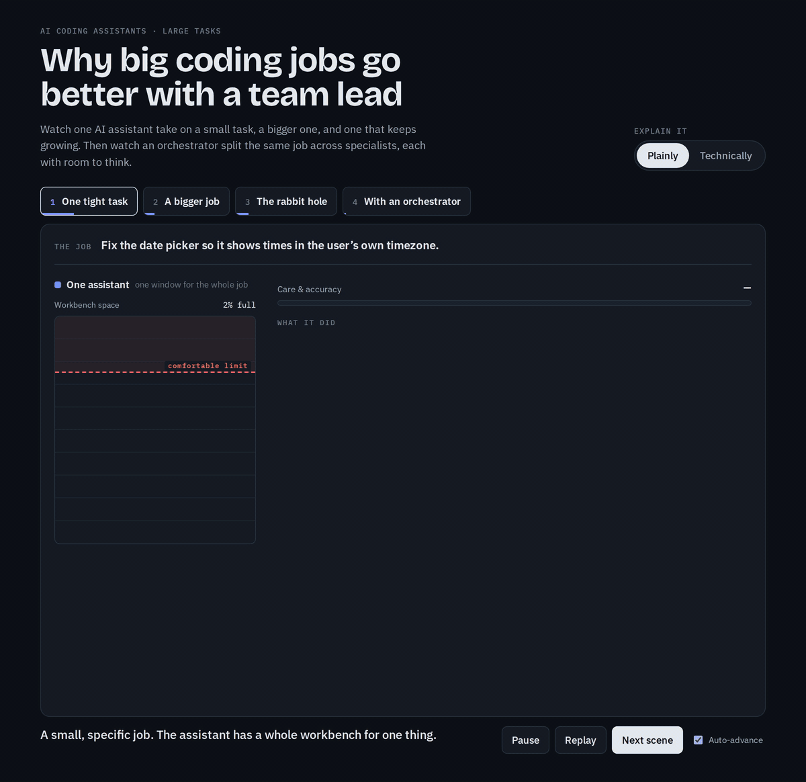
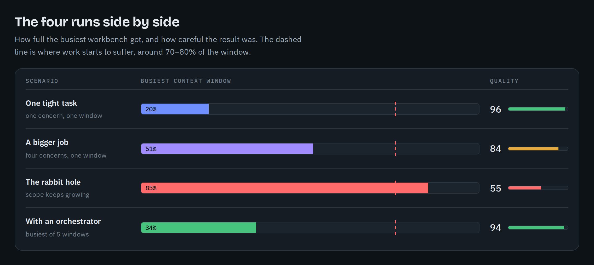

# The orc pack

> **New in v1.15.0:** two orc sessions can share one project: a second session works in its own git worktree and catches up before it pushes, and `/orc-loop` (new in v1.14.0) holds the project for its whole batch. See [Run two sessions in one project](#run-two-sessions-in-one-project) and the [changelog](CHANGELOG.md#1150---2026-10-07).

`/orc` is an autonomous orchestrator for Claude Code. You point it at work — or let it pick the work — and it carries that work all the way to committed, reviewed, green code without you babysitting it. It's built for "yolo" runs: kick it off (on Opus 5.5 by default, or on Sonnet 5.5 in efficiency mode after one confirmation), walk away, come back to a finished issue and a written summary of what it did and why.

Under the hood it runs **subagent-driven development**. The orchestrator keeps its own context clean and dispatches the actual work to a team of specialized subagents — a scout that picks the next issue, specialist builders that write the code (UI, API, data, and a general builder for everything else), a panel of reviewers that check it, and a skeptical verifier that filters out the reviewers' false positives. It loops between reviewing and fixing until only nitpicks are left, then runs your repo's checks, commits, and closes the issue.



_An illustration of the idea; the figures are illustrative, not benchmarks. In orc, specialist builders take UI, API, and data tasks one at a time, and specialist reviewers check every diff._ [Watch in higher quality (MP4)](docs/media/orchestrator-explainer.mp4)

### Why an orchestrator?

An agent does its most careful work while its context window has room to spare. As one window fills past about three-quarters, it starts skimming files, assuming interfaces, and deferring tests. Orc keeps every window small by giving each subagent one focused brief, so even the busiest window in a run stays well under that line.



This pack contains the `/orc` skill plus all the agents it relies on, written to work in **any** repo.

---

## The three ways to run it

**1. Undirected — "just pick something and go."**

```
/orc
```

With no argument, orc dispatches a lightweight scout agent (`next-issue-finder`, on Opus 5.5 at low effort, or Sonnet 5.5 in [efficiency mode](#pick-a-model-default-or-efficiency-mode)) that reads your GitHub issue board and picks the single highest-value issue to work on next, using a four-signal ruleset: does it unblock other work, how severe/impactful is it, how ready is it to execute, and how old is it. Then it runs the whole build-review-commit-close cycle on that issue.

**2. Directed at an issue — "do this specific one."**

```
/orc 123
```

Give it an issue number (or "finish the epic", "do #18") and it skips the scouting and goes straight to work on that issue.

**3. Free-text task — "here's what I want, figure it out."**

```
/orc add rate limiting to the upload endpoint
/orc the date picker breaks on Safari, track it down and fix it
```

Describe the work in plain language and orc treats your sentence as the spec. It reads the relevant code, turns your one-liner into a concrete, testable definition of done, and builds it — no issue required.

The same mode runs **cleanups**. Point orc at existing code and it improves it to the pack's standards without changing what it does:

```
/orc clean up the slop in src/lib/billing
/orc tidy the comments in the dashboard components
```

Orc audits the target with its reviewers, pins today's behavior with characterization tests where coverage is thin, then refactors in small, reviewed `refactor:` and `docs:` commits. If the audit finds nothing worth changing, it says so and stops.

In every mode, orc ends with one explicit line so you know the outcome at a glance:

- **`FINISHED`** — work landed, green, pushed, issue closed.
- **`FINISHED (no build)`** — there was genuinely nothing to build (empty board, or every issue was blocked), so it did board work instead — filed evidence, labels, new issues.
- **`NOT FINISHED`** — a real human-only blocker (dirty tree, missing credential, a decision only you can make). It tells you exactly what to do to unblock it.

### Run a batch unattended: `/orc-loop`

```
/orc-loop          # about 5 issues from the board
/orc-loop 3        # a smaller batch
/orc-loop #41      # an epic's open sub-issues
```

`/orc-loop` plans a batch of issues, lands each one with `/orc` (pushed, CI green, issue closed), then reviews the batch as a whole for what a per-issue review can't see: changes that contradict each other, logic written twice, and drift in how the issues solved similar problems. It fixes what that review finds and rechecks the fix, up to three rounds, and files whatever survives as issues. To save tokens, each `/orc` run in the batch uses a lighter review: it keeps every reviewer that stops a problem spreading to the next issue and checks comments only on the lines it changed. After the reviews, a fallow pass checks everything the batch changed for dead code and for code it duplicated, then a final comment cleanup reads every file the batch changed, once. In a batch of independent issues, picked to avoid sharing files, the runs also leave test coverage on standard tasks to one check over the whole batch. `/orc` on its own keeps its full review. It runs under `/loop`, keeps its state in `.git/orc-loop/`, and picks up where it left off if you stop and restart it. The first time it runs in a repo it asks one question, whether the agents' notes in `.claude/agent-memory/` go in `.gitignore`, then runs without asking anything else. It ends with `LOOP FINISHED`, `LOOP FINISHED (no build)`, `LOOP NOT FINISHED`, or `LOOP NOT STARTED` when something stopped it before it planned anything.

### Run two sessions in one project

You can start a second `/orc` while another orc run, or an `/orc-loop` batch, is still working in the same checkout. The first run holds a lock inside `.git`; the second sees it and moves into its own git worktree under `.claude/worktrees/`, on an `orc/<slug>` branch, so neither run sweeps the other's changes into its commits. Start with `/orc in a worktree …` to isolate a run even when nothing else is running. Orc keeps the worktree out of `git status` and removes it when the run ends, unless it still holds uncommitted work.

The dirty-tree rule still applies to your own edits: a dirty tree with no other orc run behind it stops the run, as before. When the other run pushed first, orc rebases its own unpushed commits onto the new integration branch, re-runs the ready check, and then pushes. A run that started with unpushed commits already on the branch doesn't rebase them; it stops `NOT FINISHED` instead. If that rebase conflicts, it never resolves the conflict itself: it pushes its work to the `orc/<slug>` branch and ends `NOT FINISHED`, naming the branch and the conflicting files for you to merge.

---

## Pick a model: default or efficiency mode

The model you start orc on sets how it spends tokens.

- **Opus 5.5 (`claude-opus-5-5`) — the default.** Orc starts right away and runs with its full quality settings. Use this when quality matters most.
- **Sonnet 5.5 (`claude-sonnet-5-5`) — efficiency mode.** Orc first asks you to confirm, then runs just as autonomously. Expect a lower token bill and slightly lower quality.

In efficiency mode, orc itself runs on Sonnet 5.5, the model you started it on. It also moves three smaller jobs from Opus 5.5 to Sonnet 5.5:

- **Picking the next issue.** Orc still checks the pick before building.
- **Building a trivial task**, such as a typo, a constant, or a copy change. The task's reviewer still checks it on Opus 5.5.
- **A first round of fixes for minor review findings.** Anything blocking, or anything from the security reviewer, stays on Opus 5.5, and an Opus 5.5 reviewer re-checks the fix.

Everything else keeps its usual model: every reviewer and the verifier, data and migration work, and the first build of every larger change. To offset running the coordinator on a cheaper model, orc also leaves more decisions to its Opus agents: it doesn't edit code itself, and it defers to the design reviewer on a disputed design.

Run Sonnet 5.5 at high effort (`/effort high`) for this mode; Claude Code's default is medium.

To skip the confirmation, for example in a non-interactive run, start the invocation with `efficiency mode`:

```
/orc efficiency mode 123
```

The words count only at the start, and only on Sonnet 5.5. Don't run orc on Opus 5 (`claude-opus-5`); it refuses to start there.

---

## What's in the box

**The skills:**

- `skills/orc/` — the orchestrator itself, plus `references/`: the shared standards its agents write and review against (see [The standards](#the-standards)).
- `skills/orc-loop/` — runs `/orc` over a batch of issues unattended, then reviews the batch as a whole. See [Run a batch unattended](#run-a-batch-unattended-orc-loop).
- `skills/orc-loop-iter/` — the lighter-review `/orc` run that `/orc-loop` uses for each issue and fix. Hidden from the `/` menu; it ships with `orc-loop`.
- `skills/update-orc/` — updates an installed pack to the latest release from any older version, by dispatching the `orc-updater` agent. See ["Updating the pack"](#updating-the-pack) below.
- `skills/newissue/` — turns a rough idea into a detailed, self-contained GitHub issue: a plain-language title and lead paragraph a PM can track, full technical detail below for the executing agent, sized so one orc run can carry one issue to done — splitting into multiple issues, or an `[EPIC]` with an ordered roadmap of children, when the work is too big for one. It's how orc's Discoveries step files follow-up work, and it takes per-repo house rules (labels, milestones, tone) from `.claude/newissue.local.md` or your `CLAUDE.md`. Optional, but the board gets much better with it.
- `skills/shipcheck/` — run `/shipcheck` after a push. It waits for CI and fixes a red run (two attempts at most), checks that every secret in `.claude/required-secrets.md` exists in the target environment, waits until the deploy serves the pushed commit, then runs each flow in `.claude/smoke-checklist.md` in Chrome at 390px and 1440px in light and dark mode. It stops and tells you what to unlock at an SSO or VPN wall, and turns each regression into a fix branch with a reproducing test or an issue with screenshots. It drafts both files from your code the first time.

**The agents** (`agents/`):

| Agent                    | Role                                                                                                                      |
| ------------------------ | ------------------------------------------------------------------------------------------------------------------------- |
| `next-issue-finder`      | Scout — picks the next issue from the board (used only in undirected runs)                                                |
| `implementer`            | General builder: tooling, config, scripts, cross-cutting changes, and cleanup runs, plus any task no specialist fits      |
| `ui-implementer`         | Builds components, pages, styles, and copy on the repo's design system, with every state, keyboard support, and themes    |
| `api-implementer`        | Builds endpoints, services, integrations, and jobs: boundary validation, error contracts, authorization, bounded retries  |
| `data-implementer`       | Writes schema changes, migrations, backfills, and indexes; runs them only against a local or test database                |
| `orc-updater`            | Applies an orc-pack release to an installed copy, converging it on the target kit (runs on Opus 5.5; used by /update-orc) |
| `lint`                   | Runs the repo's lint/format chain, reports raw results                                                                    |
| `typecheck`              | Runs the repo's type checker                                                                                              |
| `test`                   | Runs the repo's test suite(s)                                                                                             |
| `impact`                 | Diff stats for a change                                                                                                   |
| `fallow`                 | Codebase-intelligence audit on JS/TS repos — dead code, duplication, complexity, circular deps (self-skips when absent)   |
| `scope-reviewer`         | Holds each diff to the run's work contract: out-of-scope changes, unproven criteria, unwanted mocks                       |
| `security-reviewer`      | Input validation, secrets, XSS, SSRF, injection, path traversal                                                           |
| `design-reviewer`        | Approves a design brief before code is written, for structural tasks                                                      |
| `architecture-reviewer`  | Separation of concerns, module boundaries, file and folder structure, framework conventions                               |
| `quality-reviewer`       | Readability, AI slop code, type safety, error handling, async and state, reuse, performance                               |
| `comment-reviewer`       | Cold-read test on every comment in touched files; JSDoc on exports; slop comments                                         |
| `ui-reviewer`            | Design system and theme, states, interaction, responsive, accessibility, copy; screenshots when the app runs locally      |
| `test-coverage-reviewer` | Depth and meaningfulness of test coverage                                                                                 |
| `verifier`               | Skeptical second pass that filters reviewer false positives                                                               |
| `docs-writer`            | Project documentation                                                                                                     |
| `skill-vetter`           | Static security audit of untrusted skills/plugins before you install them                                                 |
| `dependency-vetter`      | Supply-chain security vet of a package version (fallow) before install/update                                             |

Every builder writes code and tests together and never commits; orc owns the history. Orc assigns each task the builder for its main surface and runs builders one at a time, because concurrent writers conflict. There is no security or architecture builder on purpose: security is a lens on code written in some other domain, and architecture is checked before building (the design review of the brief) and after (the architecture review of the diff).

Orc doesn't run every reviewer on every change. It **sizes each task** — trivial, standard, or structural — and dispatches only the reviewers that the size and the diff's surfaces call for. A one-line copy fix gets a single reviewer; a change to an upload handler wakes the security reviewer; a new screen gets a design review before any code is written and a UI review after. The verifier drops findings that are only a matter of taste, so no fix round is spent on preference.

The reviewers, tooling runners, and the scout are all also useful on their own, outside of orc — for example during a manual code review.

---

## The standards

The quality bar lives in `skills/orc/references/`, and the builders write to the same files the reviewers check against, so most problems never reach a review:

- **`standards/code.md`** — readability, types, errors, async, state, reuse, and a named list of AI slop code patterns (defensive noise, pass-through layers, reinvented utilities, synced state, and more).
- **`standards/comments.md`** — the cold-read test (every comment must make sense to someone who sees only the file), JSDoc on exports following Google's style guides, and the slop comments to remove.
- **`standards/structure.md`** — layers, separation of concerns, the server and client boundary, and file and folder placement.
- **`standards/ui.md`** — design-system and theme adherence, every interaction state, responsive behavior, accessibility (WCAG 2.2 AA), and copy.
- **`standards/data.md`** — migrations, expand/contract changes, locks, backfills, indexes, and query safety.
- **`builder-contract.md`** — the rules every builder shares: the dispatch, brief and build modes, scope, no commits, suppressions only as `code.md` allows, fix rounds, and the report.
- **`frameworks/`** (Next.js, Nuxt, SvelteKit, Astro) and **`platforms/`** (Cloudflare, Vercel) — each loads only when orc detects that stack, and tells the agents to trust the installed version's docs over the playbook.

Your repo always wins: every file defers to your `CLAUDE.md`/`AGENTS.md` and your established patterns, and orc follows an existing project structure rather than reshaping it. Files the diff touches get cleaned up as part of the task; messy files it doesn't touch come back in the report as cleanup cards, not rewritten on the side.

---

## Fallow

Fallow is a static codebase-intelligence pass that finds dead code, code duplication, complexity hotspots, circular dependencies, and unused or unlisted dependencies. It runs as a standard part of orc's review loop on JS/TS repos — the `fallow` agent scopes `fallow audit` to the task diff and reports the findings, and it self-skips on a non-JS/TS project. It is installed by default after it passes the same supply-chain vet. The pack only reads: it never runs `fallow fix`, which would rewrite source.

---

## Progress on your status line

Install [paceline](https://github.com/rogadev/paceline), a Claude Code status line, and register its `paceline-mcp` server to watch a run's progress without reading the transcript:

```
orc #42 ▰▰▰▰▱▱ t2 upload limit review 62%
```

Orc starts the bar as soon as it has oriented, with an `investigate` cell for picking and sharpening the work and a `plan` cell for the contract and task list. Once the plan exists, it adds one cell per task, then a `ready check` cell and a `push` cell, so a two-task run shows six cells and the highlighted cell is the one in progress. A task's label names what it builds and the stage it is in: design on structural tasks, then build, review, and any fix rounds (`fix 1` to `fix 3`). Each task is weighted by size, so the percentage tracks the real work rather than a step count. A task added mid-run gets its own cell, and the ready check and push cells move to stay last. A run with nothing to build shows its real steps, such as a verification or an issue comment, instead. `/orc-loop` draws its own bar, with one cell per issue, then cells for the batch review, the fallow pass, and the comment cleanup (`loop ▰▰▱▱ #41 upload limit ci`), and the `/orc` runs it starts leave the bar to it. Without paceline, both skip this silently. The updates ride along with calls orc already makes, so they add no turns and cost a few hundred tokens per task.

---

## Two ways to install

**As a plugin — quickest, available in all your projects.** This repo is its own Claude Code plugin marketplace. In any Claude Code session:

```
/plugin marketplace add rogadev/orc-pack
/plugin install orc-pack@orc-pack
```

The skill and all agents load automatically after install; the skill is invoked as `/orc-pack:orc`. The plugin version is pinned in `.claude-plugin/plugin.json`, so you receive updates when a new version is released, not on every commit.

**Into a repo — committable and tunable.** Copy the pack into one repo's `.claude/` so it ships with the repo, can be committed for a team, and can be tuned to that repo's stack (a repo-specific security reviewer, for example). Plugin files live in a read-only cache; repo copies are yours to edit. This is the path described in the next section, and it's the right one for team repos or customized installs.

## Installing it into a project

The companion `INSTALL.md` is written **for an AI agent**. The intended flow:

1. Open a Claude Code session in the repo you want orc in — that repo is the install target.
2. Point Claude at this repo's URL, for example: _"Install https://github.com/rogadev/orc-pack into this repo."_ Claude clones the kit into a scratch location and follows `INSTALL.md`. If you already have a clone somewhere outside the target project, you can point at that instead: _"Read the INSTALL.md in `~/orc-pack` and install this pack into this repo."_
3. Claude copies the skill to `.claude/skills/orc/` and the agents to `.claude/agents/`, checks for conflicts with anything already there, adapts to your repo, and verifies the result.

If you'd rather do it by hand, it's just a copy:

- `skills/orc/` (the whole directory, including `references/`) → `<repo>/.claude/skills/orc/`
- every file in `agents/` → `<repo>/.claude/agents/<same-name>.md`

Use `~/.claude/` instead of `<repo>/.claude/` if you want orc available in every project on your machine rather than just one. Either way the pack goes into the repo your session is open in, never into a checkout of `orc-pack` itself; if Claude starts "installing" into an `orc-pack` folder it found on your machine, stop it and open the session in the target repo. **Skills and agents load when a session starts**, so start a fresh Claude Code session after installing.

> The pack's agents are written to be generic — they discover your repo's stack, commands, and conventions at runtime by reading your `CLAUDE.md`/`AGENTS.md`, your manifest, and the surrounding code. They work as-copied. If your repo has a `CLAUDE.md` that documents your ready command (like `pnpm ready`) and your working branch (like `dev`), orc picks those up automatically.

---

## Updating the pack

- **Plugin install** — nothing to do by hand. `/plugin update orc-pack@orc-pack` (or an automatic update) picks up a new version once `plugin.json`'s version changes.
- **Copied-into-`.claude/` install** — run `/update-orc`. It reads your installed version, finds the latest GitHub release, fetches the pack at that tag, and dispatches an Opus 5.5 updater that converges your copy on the release. It works from **any** older version in one pass, so you don't step through releases one at a time; it reads every changelog entry in the gap plus the release's update notes as its map (falling back to the tag diff when notes are thin), preserves your repo-local edits, and never clobbers a file the repo owns. It does not commit — review the changes, then commit and push them yourself.

Every release's notes come from `CHANGELOG.md`, and the release guard refuses to publish a version without a section there. That's what keeps future update agents oriented.

---

## Turn on the to-do list (newer models)

Orc runs best when it can build its plan as a **live task list** and work it top to bottom — that's how an unsupervised run never drops a step. The task list is orc's spine.

Recent Claude Code versions (v2.1.233+) **turn the to-do / Task tools off by default on newer models** — including **Opus 4.8**, **Sonnet 5**, and Fable 5, and likely the models released since, such as Opus 5.5 and Sonnet 5.5. The reasoning from the docs: these models track multi-step work internally, and the tool definitions take up context, so Claude Code omits them unless you opt in. Since orc runs on those newer models, you'll want to switch the tools back on.

**The fix — set one environment variable before launching Claude Code:**

```bash
# macOS / Linux
export CLAUDE_CODE_ENABLE_TODO_TOOLS=1
claude
```

```powershell
# Windows PowerShell
$env:CLAUDE_CODE_ENABLE_TODO_TOOLS = "1"
claude
```

To make it permanent, add `CLAUDE_CODE_ENABLE_TODO_TOOLS=1` to your shell profile (`~/.bashrc`, `~/.zshrc`) or your Windows user environment variables so every session has it.

**Alternative — allow the tools explicitly at launch:**

```bash
claude --allowedTools TaskCreate TaskGet TaskList TaskUpdate
```

Once enabled, the model gets the four Task tools (`TaskCreate`, `TaskGet`, `TaskUpdate`, `TaskList`) and orc uses them to track its plan as it works.

> **If you don't turn them on**, orc still runs — the skill tells it to fall back to an inline checklist in its reasoning. But the built-in task list is a much better experience, and it's what the "adds to-dos as it builds its plan" behavior depends on.

> **Which tools, exactly?** `TaskCreate/TaskGet/TaskUpdate/TaskList` are the current, persistent task system (stored under `~/.claude/tasks/`). The older `TodoWrite` was an ephemeral, in-context-only checklist and is deprecated. `CLAUDE_CODE_ENABLE_TODO_TOOLS=1` turns the current Task tools on.
>
> Setting names and defaults can shift between Claude Code releases — if the variable above doesn't take effect, check your version's tools reference (`code.claude.com/docs`) for the current knob.

---

## How a run actually flows

1. **Orient & guard.** Orc reads your repo conventions and refuses to start on a dirty working tree or a protected branch (`main`/`master`) — those are yours to clear first.
2. **Get the work.** Scout picks an issue (undirected), or it takes your issue number / free-text task.
3. **Make it buildable.** Most work isn't perfectly spec'd. Orc sharpens it — splitting off the executable part, shipping a defensible default for a missing tuning value, or writing down a decision — rather than stopping because the issue was vague. Then it writes a **work contract**: one sentence naming the exact files it believes you mean, what's in and out of scope, every integration marked real or mocked, its assumptions, and three to six acceptance criteria that each name a test. It states that sentence in chat as it starts and posts the contract on the issue. Start with `/orc contract first …` to approve the contract before anything is built.
4. **Plan as tasks.** It decomposes the contract's criteria into a task list and works it in order. Builders write each acceptance test first and show it failing before they write the change, and a scope reviewer holds every diff to the contract.
5. **Design → build → review → fix, looping.** Per task: orc assigns the builder for the task's surface (UI, API, data, or general); for structural work, that builder writes a short design brief and the design reviewer approves it first; then the builder writes code and tests to the shared standards; the reviewers that apply check the diff; `fallow` scans JS/TS diffs for dead code and duplication; the verifier filters false positives and matters of taste; real defects and warnings go back for a fix. Bounded at three rounds so it can't loop forever.
6. **Small discoveries get done; bigger ones come back sized.** Orc sizes everything it finds along the way as Small (one task), Medium (one run), Large (several runs), or Huge (an epic). Small work gets built this run, through the same review loop as the rest. Medium and larger work comes back as a card with its size, impact, recommendation, and issue status, so the run never grows silently and approving a card means agreeing to a known amount of work. Quality debt in files the run doesn't touch also comes back as a card, with the `/orc clean up …` command to run, so a small issue never turns into a sweep of the codebase. Orc files an issue on its own only for genuine human-only calls (a policy or security decision, an external contract, spending money); for everything else, the card names any matching issue or recommends filing one, and you decide.
7. **Ready & land.** It runs your repo's aggregate check, and only if that's green does it push and close the issue.
8. **Report.** A tight, point-first summary in the Google developer-documentation voice — what it picked and why, what landed and where, what changed on the board, heads-ups you don't need to act on, and a sized card for each thing that needs your call — capped by the one literal status line (`FINISHED` / `FINISHED (no build)` / `NOT FINISHED`).

## Good to know

- **It commits and pushes to your working branch** (typically `dev`) but **never opens a PR, never touches `main`, and never force-pushes.** Promoting to your release branch stays your decision.
- **It won't fake a finish.** It won't suppress a failing check, silence a real defect, or close an issue it didn't actually resolve. A `NOT FINISHED` is honest.
- **It's for repos that track work as issues** (for the undirected and issue modes) and use `gh`. The free-text mode works without an issue board.
- **Watch the first few runs.** "Autonomous" doesn't mean "unsupervised forever" — get a feel for how it picks and scopes work in your repo before you truly walk away.
